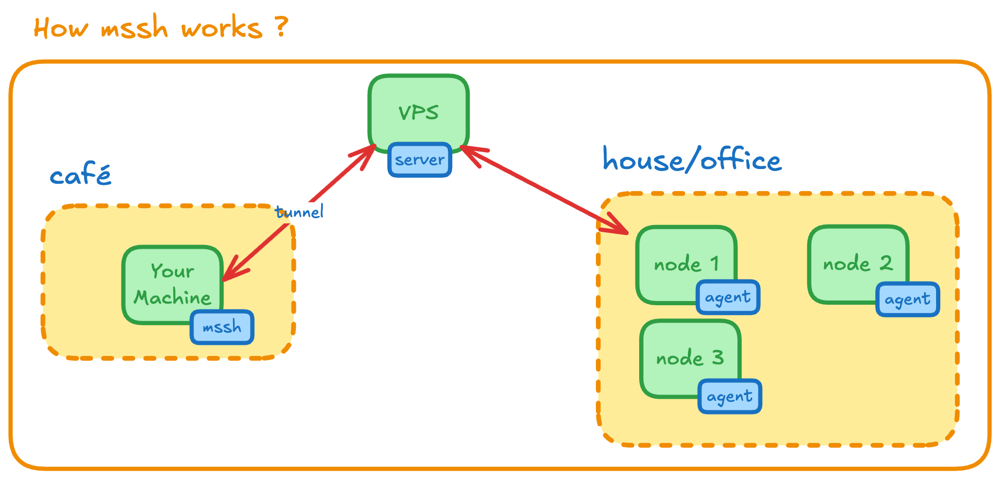

# mssh

Minimal rendezvous service for reaching SSH behind NAT

This enables SSH access to machines behind NAT/firewalls using a simple rendezvous server. No complex VPN setup required.



## Usage

Deploy the server on a publicly reachable machine, run the agent on each host behind NAT, then connect from your workstation using either the built-in Go SSH client or the ProxyCommand approach described below.


| Command | Purpose |
|---------|---------|
| `mssh server` | Runs the rendezvous service on a public host |
| `mssh agent <node-id>` | Keeps a connection open from a NATed host back to the server |
| `mssh proxy <node-id>` / `mssh user@node` | Lets you connect from your workstation |

### Server

Run the rendezvous server:

```bash
mssh server --host 0.0.0.0 --port 8443
```

> **Production tip:** Deploy behind a TLS proxy (nginx, Traefik, Caddy) with Let's Encrypt for secure public exposure.

### Agent

Run on the remote host behind NAT:

```bash
# With explicit node-id
mssh agent prod-db-1 --server rendezvous.example.com:8443 --ssh-port 22

# Auto-detect node-id from primary IPv4
mssh agent --server rendezvous.example.com:8443
```

The agent automatically re-registers after each session ends.

**Node-ID rules:** May contain letters, digits, `.`, `_`, and `-`. If omitted, the primary IPv4 address is used.

### Client

**Built-in SSH client:**

```bash
mssh alice@prod-db-1

# With custom server or identity
mssh alice@prod-db-1 --server other.example.net:8443 --identity ~/.ssh/prod_key
```

The client scans `~/.ssh/id_{ed25519,rsa,ecdsa}` (with passphrase prompts) and falls back to `SSH_AUTH_SOCK`.

**ProxyCommand integration:**

```bash
ssh -o ProxyCommand="mssh proxy prod-db-1 --server rendezvous.example.com:8443" alice@localhost
```

To make this seamless, add it to `~/.ssh/config` so `ssh prod-db` works without long command lines:

```ssh-config
Host prod-db
    HostName localhost
    User alice
    ProxyCommand mssh proxy prod-db-1 --server rendezvous.example.com:8443
```

Now simply run `ssh prod-db` and the ProxyCommand will invoke `mssh proxy ...` behind the scenes.

## Systemd Integration

The install script automatically configures systemd units. To customize manually:

**Server:**

```bash
sudo cp install/systemd/mssh-server.service /etc/systemd/system/mssh-server.service
sudo systemctl daemon-reload && sudo systemctl enable --now mssh-server
```

**Agent:**

```bash
sudo cp install/systemd/mssh-agent.service /etc/systemd/system/mssh-agent.service
sudo systemctl daemon-reload && sudo systemctl enable --now mssh-agent
```

Edit the `ExecStart` line in each unit file to customize flags.

---

## Security

- **TLS termination:** Place the rendezvous server behind a TLS proxy (nginx/Caddy/Traefik) with Let's Encrypt
- **Optional hardening:** Add mutual TLS or IP filtering at the proxy layer

---

## License

MIT
