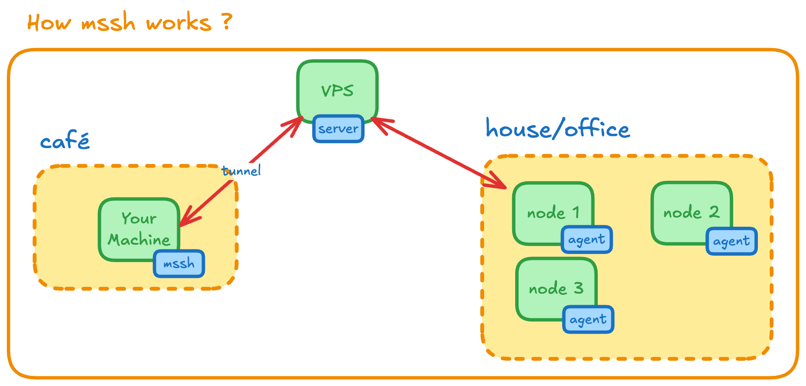

# mssh

Reach SSH servers behind NAT through a rendezvous server. Run an agent on each node, then connect with the built-in SSH client or OpenSSH through ProxyCommand.



## Upgrade

Version 0.2 uses a new protocol. Upgrade the server, agents and clients together. Public listeners now require TLS and a shared token. The built-in SSH client requires trusted host keys. Read the [protocol and migration guide](docs/protocol.md).

Each agent supports one connection at a time. Other clients receive `agent busy` during a session. The agent registers again two seconds after that session ends.

## Server

For a local test, bind to loopback:

```bash
mssh server
```

For a public server, provision a TLS certificate that covers its hostname. Create a token file with mode `0600`:

```bash
umask 077
openssl rand -hex 32 > /etc/mssh/token
mssh server --host 0.0.0.0 --port 8443 \
  --tls-cert /etc/mssh/cert.pem --tls-key /etc/mssh/key.pem \
  --token-file /etc/mssh/token
```

Create `/etc/mssh` first and run these commands with the required file permissions. Give the same token to trusted agents and clients through a secure channel. Token holders can register or connect to any node on this server. Use separate servers and tokens for separate trust groups.

TLS is built into mssh. Clients check the certificate against system roots. For a private CA, use `--tls-ca /path/to/ca.pem`. This also enables TLS. A plain TCP client cannot connect directly to a TLS termination proxy.

## Agent

Run on the host behind NAT:

```bash
mssh agent prod-db-1 --server rendezvous.example.com:8443 \
  --tls --token-file /etc/mssh/token --ssh-port 22
```

The node ID is a positional argument. Omit it to use the primary IPv4 address, with the hostname as a fallback. IDs use letters, digits, `.`, `_` and `-`, with a limit of 128 characters.

The agent waits for a client before it opens local SSH. Idle registrations use heartbeats, and stale registrations are removed. For a local test, `mssh agent prod-db-1` uses `localhost:8443` when no server is configured.

## Configuration

The agent, proxy and built-in SSH client read `~/.mssh/config.yaml`:

```yaml
server: rendezvous.example.com:8443
tls: true
token_file: ~/.mssh/token
identity: ~/.ssh/id_ed25519
nodes:
  prod-db-1:
    server: private-rendezvous.example.com:8443
    tls_ca: ~/.mssh/private-ca.pem
    identity: ~/.ssh/prod_key
```

Flags override node values, which override global values. Run `mssh config init` to set the server and default SSH identity, then add TLS and token settings to the file. Paths accept `~` and `~/`; named-user forms such as `~alice` are not expanded.

## Client

Add a verified SSH host key to `~/.ssh/known_hosts` under the node ID before the first connection. Get the public host key from the node through a trusted channel. The [protocol guide](docs/protocol.md) explains the entry format. Unknown or changed keys are rejected.

With config in place:

```bash
mssh alice@prod-db-1
```

Or pass connection settings explicitly:

```bash
mssh alice@prod-db-1 --server rendezvous.example.com:8443 \
  --tls --token-file ~/.mssh/token --identity ~/.ssh/prod_key
```

The client scans common private keys in `~/.ssh` and can use `SSH_AUTH_SOCK`. Encrypted keys prompt for a passphrase. An explicit identity that cannot be loaded stops the command. Remote shell exit codes are returned after local terminal restoration.

For OpenSSH, use a node-specific host identity:

```ssh-config
Host prod-db-1
    HostName prod-db-1
    HostKeyAlias prod-db-1
    User alice
    ProxyCommand mssh proxy %h
```

Then run `ssh prod-db-1`. The proxy reads the same rendezvous config. OpenSSH performs its own SSH host-key and authentication checks.

## Installation

The installer supports Linux amd64 and arm64. It verifies the archive against the checksum published with the release. Set `VERSION=v0.2.0` to pin a release. `BIN_DIR` must be an absolute path and defaults to `/usr/local/bin`.

Download and review the script before running it:

```bash
curl -fsSL https://raw.githubusercontent.com/eznix86/mssh/main/install/install.sh -o /tmp/install-mssh.sh
sudo bash /tmp/install-mssh.sh
```

For a public server service, provision its certificate, key and token first:

```bash
sudo bash /tmp/install-mssh.sh server --host 0.0.0.0 --port 8443 \
  --tls-cert /etc/mssh/cert.pem --tls-key /etc/mssh/key.pem \
  --token-file /etc/mssh/token
```

For an agent service:

```bash
sudo bash /tmp/install-mssh.sh agent prod-db-1 \
  --server rendezvous.example.com:8443 --tls \
  --token-file /etc/mssh/token --ssh-port 22
```

Service installation requires systemd. Services run as root, so use absolute paths to their files. An agent installation with no flags prompts on the terminal. The installer does not need `envsubst`.

macOS amd64 and arm64 binaries are available on the [releases page](https://github.com/eznix86/mssh/releases). For a manual build on Linux or macOS:

```bash
go build -o mssh ./cmd/mssh
sudo install -m 0755 mssh /usr/local/bin/mssh
```

Release binaries report their tag through `mssh --version`. Manual builds report `dev` unless a version is set with `-ldflags '-X main.version=...'`.

To uninstall on Linux:

```bash
curl -fsSL https://raw.githubusercontent.com/eznix86/mssh/main/install/uninstall.sh -o /tmp/uninstall-mssh.sh
sudo bash /tmp/uninstall-mssh.sh
```

This removes the binary and disables the mssh systemd units. It does not remove config, tokens or certificates.

## Development

```bash
go test -race ./...
go vet ./...
python3 install/test_install.py -v
bash -n install/install.sh install/uninstall.sh
```

The Go tests cover SSH cleanup, terminal restoration, host keys, config precedence, protocol limits, TLS and token checks, agent pairing, proxy EOF, TCP half-close and shutdown. Python 3 is needed for PTY tests and installer tests. Installer tests use local fixtures and do not change system services.

## License

MIT
